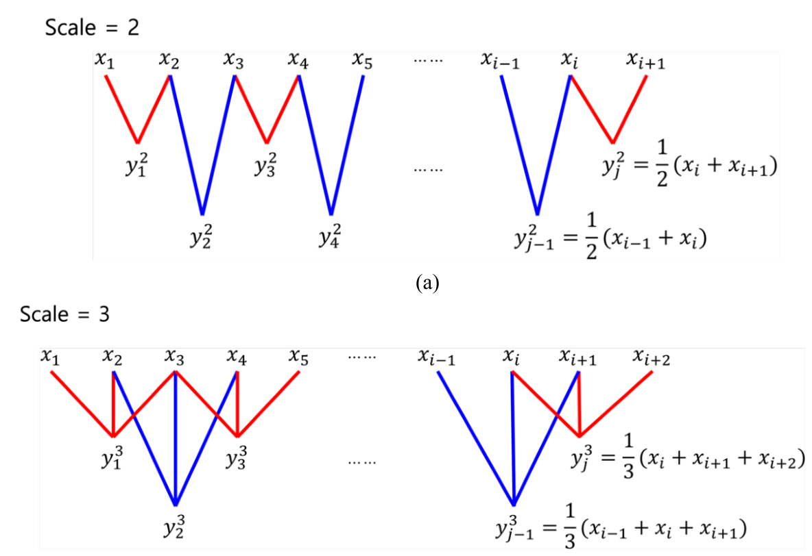
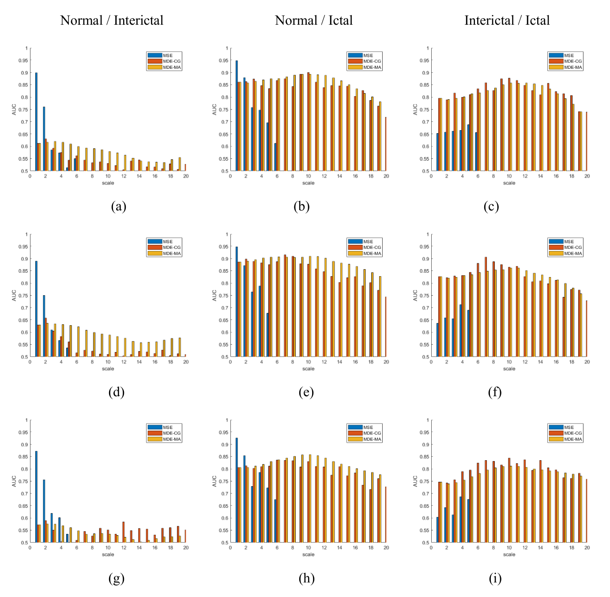
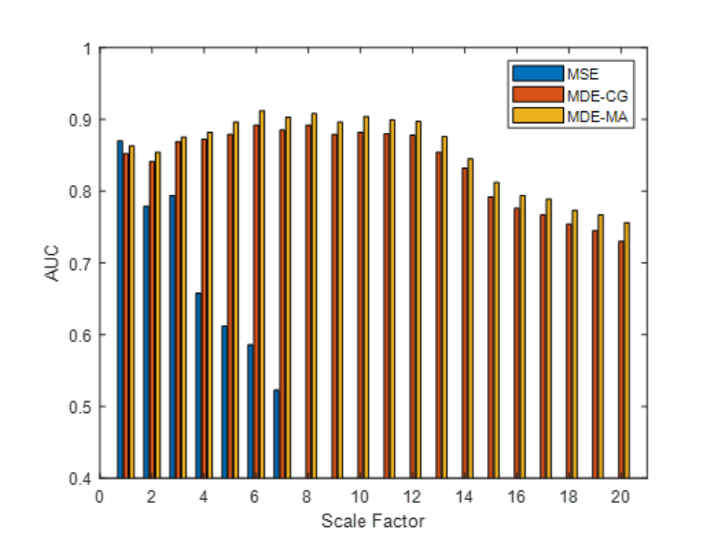

# Multiscale Distribution Entropy Analysis of Short Epileptic EEG Signals

Dae Hyeon Kim, Jin-Oh Park, Dae-Young Lee, and Young-Seok Choi  
*Mathematical Biosciences and Engineering* 21(4), 5556–5576, 2024. [Paper](https://doi.org/10.3934/mbe.2024245)

Dae Hyeon Kim and Jin-Oh Park contributed equally.

Multiscale entropy analysis of short EEG segments using coarse-graining (MDE-CG) and moving averaging (MDE-MA).

## Method

*Paper Figure 2. Moving-average construction retains overlapping samples at each scale.*

| Method | Scale construction | Entropy estimator |
|---|---|---|
| MSE | Non-overlapping coarse-graining | Sample entropy |
| MDE-CG | Non-overlapping coarse-graining | Distribution entropy |
| MDE-MA | Sliding moving average | Distribution entropy |

At scale s, coarse-graining produces floor(N/s) samples; moving averaging produces N − s + 1. Distribution entropy is computed from the distribution of distances between embedded vectors.

## Experiments

| Dataset | Comparison | Evaluation |
|---|---|---|
| Bonn | Normal, interictal, and ictal EEG | Three five-second intervals; entropy across scales; pairwise Mann–Whitney U tests and ROC AUC |
| Bern–Barcelona | Focal and non-focal EEG | Multiscale entropy and ROC AUC |

### Bonn: pairwise discrimination

*Paper Figure 7. Rows correspond to intervals A, B, and C; columns compare normal/interictal, normal/ictal, and interictal/ictal EEG. Curves retain the original scale-dependent values.*

### Bern–Barcelona: focal versus non-focal

*Paper Figure 8. MDE-MA maintains higher AUC than the compared estimators over most scales above one. The result depends on scale; it is not a single classification-accuracy score.*

## Release status

| Material | Status |
|---|---|
| Method and experimental figures | Available above |
| Original analysis code and environment | **To be uploaded** |
| Reproduction instructions | **To be uploaded** |

This repository is a paper summary. It does not yet contain the original analysis implementation.
